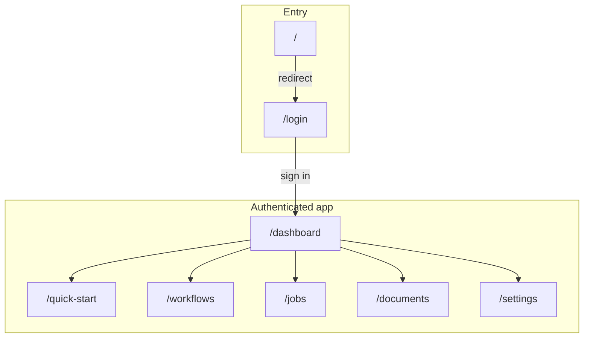

# App Flow — High-Level Navigation

High-level app entry and route structure. Use this to align UX and implementation.

## Entry and routes

## Route map (for UX)

| Route | Purpose |
|-------|---------|
| `/` | Redirect to `/login` |
| `/login` | Login / welcome (split-screen) |
| `/dashboard` | Main dashboard (stats, activity, job list) |
| `/quick-start` | Quick start wizard |
| `/workflows` | Workflow editor |
| `/jobs` | Job list |
| `/documents` | Document upload / list |
| `/settings` | Settings |

Update this diagram when you add or remove routes.
