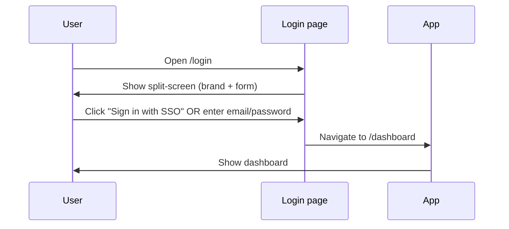
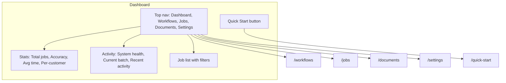
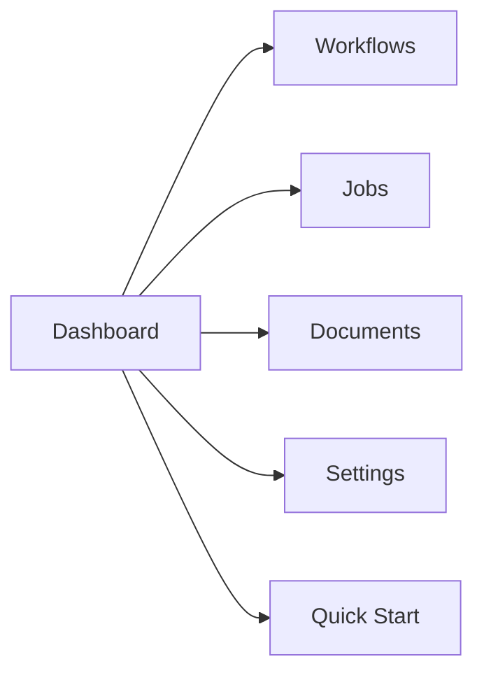

# User Flows (UX)

Mermaid diagrams for key user flows. Use these to align UX and implementation.

## Login flow



```mermaid
flowchart LR
  A[Land on /login] --> B{Sign in}
  B -->|SSO| C[/dashboard]
  B -->|Email + password| C
```

## Dashboard flow



## Navigation (from dashboard)



Add or edit diagrams here when you change login, dashboard, or navigation flows.
